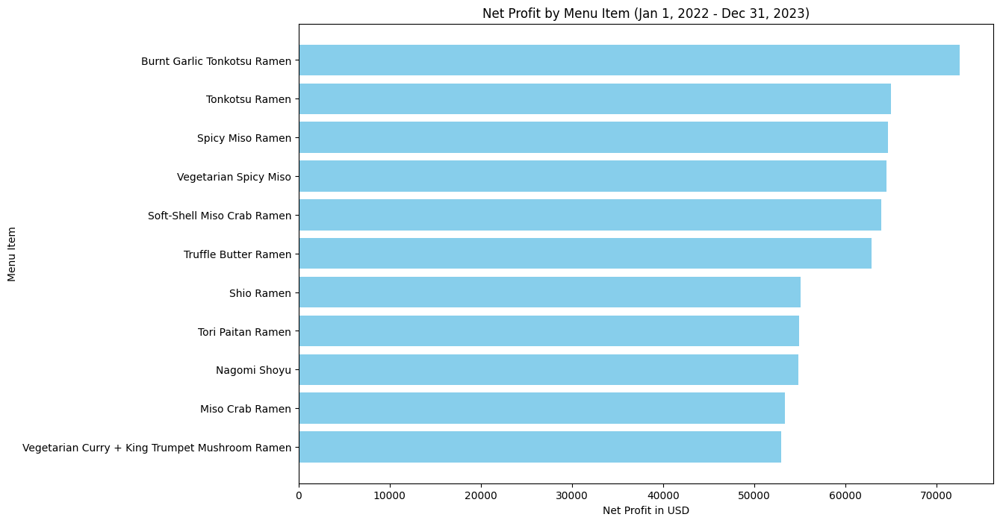

# Sales Report for A Steakhouse
## 2022/23

- This sales report extends from January 1st, 2022 to December 31st, 2023. All figures are in USD.
- Net profit by menu item:
  - burnt garlic tonkotsu ramen: 72,560
  - miso crab ramen: 53,340
  - nagomi shoyu: 54,792
  - shio ramen: 55,080
  - soft-shell miso crab ramen: 63,910
  - spicy miso ramen: 64,666
  - tonkotsu ramen: 65,016
  - tori paitan ramen: 54,936
  - truffle butter ramen: 62,874
  - vegetarian curry + king trumpet mushroom ramen: 52,944
  - vegetarian spicy miso: 64,512
- **Most profitable** menu item: **burnt garlic tonkotsu ramen (72,560)**
- **Most costly** menu item: **soft-shell miso crab ramen (63,910)**
